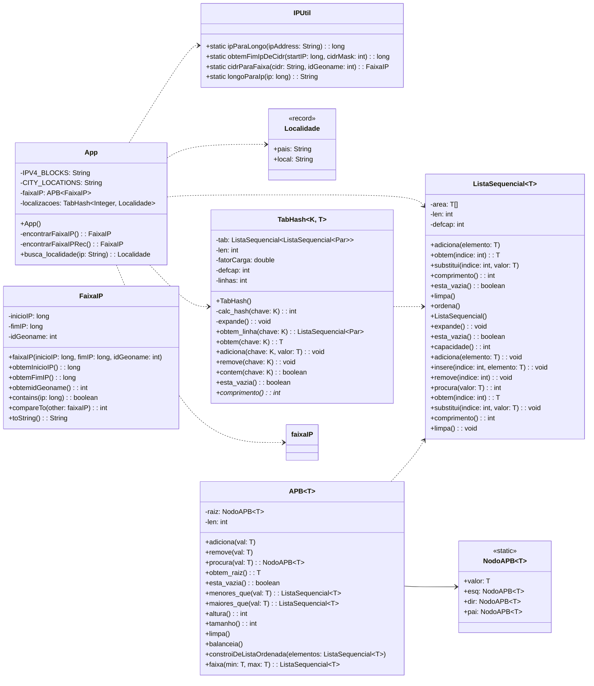

# Projeto 2 de Estruturas de Dados: Geolocalizador

## Grupo:

#### Caio Eduardo de Aguiar
#### Arthur Felaço Matos de Souza

## Estruturas de Dados Utilizadas

### Tabela Hash (**`TabHash`**)

- **Finalidade:** Armazenar as localidades (país, cidade) associadas a cada identificador GeoNameID.
- **Motivo da escolha:** A tabela hash permite buscas rápidas (O(1) na média) por chave, essencial para obter a localidade associada a um bloco de IP (como era chave e valor pensamos em usar pois cumpre exatamente o que propoe).
- **Implementação:** Usado para guardar chave e valor de país e cidade.

### Árvore Binária de Pesquisa (**`APB`**)

- **Finalidade:** Armazenar os blocos de IP (faixas), permitindo a busca eficiente do bloco que contém um determinado IP.
- **Motivo da escolha:** A árvore binária balanceada permite buscas logarítmicas (O(log n)), o que é fundamental dado o grande volume de faixas de IP (milhões de registros).
- **Balanceamento:** A árvore é construída de forma balanceada a partir dos dados ordenados, garantindo desempenho ótimo nas consultas.

## Justificativas das Escolhas

- **Eficiência:** Dado o alto volume de dados (milhões de faixas de IP e centenas de milhares de localidades), estruturas eficientes são necessárias para garantir tempos de resposta adequados, tentamos usar com listaEncadeada antes de mudarmos para listaSequencial, porém era tão lento que tentei rodar por 1 hora e não houve resultado.
- **Escalabilidade:** A escolha por uma árvore binária balanceada e tabela hash permite que o sistema escale para grandes volumes de dados sem degradação significativa de desempenho e por cumprir exatamente o que precisávamos (faixa e chave:valor).

### Diagrama de Classes

